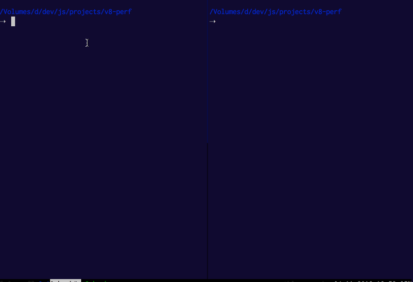

# Inspection and Performance Profiling

_find the previous version of this document at
[crankshaft/performance-profiling.md](crankshaft/performance-profiling.md)_

<!-- START doctoc generated TOC please keep comment here to allow auto update -->
<!-- DON'T EDIT THIS SECTION, INSTEAD RE-RUN doctoc TO UPDATE -->


- [General Strategies to track and improve Performance](#general-strategies-to-track-and-improve-performance)
  - [Identify and Understand Performance Problem](#identify-and-understand-performance-problem)
  - [Sampling CPU Profilers](#sampling-cpu-profilers)
  - [Structural CPU Profilers](#structural-cpu-profilers)
    - [Instrumentation Techniques](#instrumentation-techniques)
  - [Instrumenting vs. Sampling](#instrumenting-vs-sampling)
  - [Plan for Performance](#plan-for-performance)
  - [Animation Frame](#animation-frame)
- [Node.js Perf And Tooling](#nodejs-perf-and-tooling)
  - [Profile JavaScript CPU Usage of Node.js via Chrome DevTools](#profile-javascript-cpu-usage-of-nodejs-via-chrome-devtools)
  - [Resources](#resources)
  - [Profile FullStack CPU Usage of Node.js](#profile-fullstack-cpu-usage-of-nodejs)
    - [Tools To Produce Full Stack Flamegraphs](#tools-to-produce-full-stack-flamegraphs)
      - [Brendan Gregg's Flamegraph Tool](#brendan-greggs-flamegraph-tool)
      - [0x](#0x)
    - [Perf](#perf)
    - [Dtrace](#dtrace)
- [Inspecting v8](#inspecting-v8)
  - [v8 flags](#v8-flags)
    - [AST](#ast)
    - [Byte Code](#byte-code)
    - [Tracing Inline Caches](#tracing-inline-caches)
    - [Optimized Code](#optimized-code)
    - [Tracing Optimizations](#tracing-optimizations)
    - [Tracing Map Creation](#tracing-map-creation)
      - [Resources](#resources-1)
    - [Runtime Call Stats](#runtime-call-stats)
      - [Resources](#resources-2)
    - [Memory Visualization](#memory-visualization)
      - [Resources](#resources-3)
    - [Array Elements Kinds](#array-elements-kinds)
      - [Resources](#resources-4)
  - [Tools to Inspect/Visualize v8 Operations](#tools-to-inspectvisualize-v8-operations)
    - [Turbolizer](#turbolizer)
- [Considerations when Improving Performance](#considerations-when-improving-performance)
    - [Profilers](#profilers)
    - [Tweaking hot Code](#tweaking-hot-code)
  - [Resources](#resources-5)

<!-- END doctoc generated TOC please keep comment here to allow auto update -->

## General Strategies to track and improve Performance

### Identify and Understand Performance Problem

[watch](http://youtu.be/UJPdhx5zTaw?t=40m1s) |
[slide](http://v8-io12.appspot.com/index.html#83) |
[watch profiling workflow](https://www.youtube.com/watch?v=nxXkquTPng8&feature=share&t=40m50s)

Analyse performance only once you have a problem in a top down manner like so:

- ensure it's JavaScript and not the DOM
- reduce testcase to pure JavaScript and run in `v8` shell
- collect metrics and locate bottlenecks
- sample profiling to narrow down the general problem area
  - at this point think about the algorithm, data structures, techniques, etc. used in this area and evaluate if
    improvements in this area are possible since that will most likely yield greater impact than any of the more fine
    grained improvments
- structural profiling to isolate the exact area i.e. function in which most time is spent
  - evaluate what can be improved here again thinking about algorithm first
  - *only once* algorithm and data structures seem optimal evaluate how the code structure affects assembly code generated by v8 and
    possible optimizations (small functions, `try/catch`, closures, loops vs. `forEach`, etc.)
- optimize slowest section of code and repeat structural profiling

### Sampling CPU Profilers

[watch](https://www.youtube.com/watch?v=nxXkquTPng8&feature=share&t=3m20s) |
[watch walkthrough](https://www.youtube.com/watch?v=nxXkquTPng8&feature=share&t=34m00s)

- at fixed frequency program is instantaneously paused *by setting stacksize to 0* and the call stack sampled
- assumes that the sample is representative of workload
- gives no sense fo flow to due gaps between samples
- functions that were inlined by compiler aren't shown
- collect data for longer period of time, sampling every 1ms
- ensure code is exercising the right code paths

### Structural CPU Profilers

[watch](https://www.youtube.com/watch?v=nxXkquTPng8&feature=share&t=7m10s) |
[watch walkthrough](https://www.youtube.com/watch?v=nxXkquTPng8&feature=share&t=37m10s)

- functions are instrumented to record entry and exit times
- three data points per function
  - **Inclusive Time**: time spent in function *including* its children
  - **Exclusive Time**: time spent in function *excluding* its children
  - **Call Count**: number of times the functino was called
- data points are taken at much higher frequency than sampling
- higher cost than sampling dut to instrumentation
- goal of optimization is to **minimize inclusive time**
- inlined functions retain markers

#### Instrumentation Techniques

[watch](https://www.youtube.com/watch?v=nxXkquTPng8&feature=share&t=46m10s)

- think about data being processed
  - is one piece of data slower?
- name time ranges based on data
  - use variables/properties to dynamically name ranges

### Instrumenting vs. Sampling

[watch](https://www.youtube.com/watch?v=nxXkquTPng8&feature=share&t=10m30s)

```
+--------------------------------------------------------------------------------------------+
|                                   |      Sampling          |    Structural / Instrumenting |
|-----------------------------------+------------------------+-------------------------------|
| Time                              |       Approximate      |            Exact              |
| Invocation count                  |       Approximate      |            Exact              |
| Overhead                          |       Small            |            High(er)           |
| Accuracy                          |       Good - Poor      |            Good - Poor        |
| Extra code / instrumentation      |       No               |            Yes                |
+--------------------------------------------------------------------------------------------+
```

- need both
- manual instrumentation can reduce overhead
- instrumentation affects performance and may affect behavior
- samples are very accurate, but inaccurate for extracting time
- sampling requires no program modification

### Plan for Performance

[watch](https://www.youtube.com/watch?v=nxXkquTPng8&feature=share&t=47m50s)

- each module of app sould have time budget
- sum of modules should be `< 16ms` for smooth client side apps
- track performance daily or per commit in order to catch *budget busters* right away

### Animation Frame

[watch](https://www.youtube.com/watch?v=nxXkquTPng8&feature=share&t=50m00s) |
[watch walkthrough](https://www.youtube.com/watch?v=nxXkquTPng8&feature=share&t=52m20s)

- queue up key handlers and execute inside Animation Frame
- optimize for lowest common denominator that your app will run on
- for mobile stay below `8-10ms` since remaining time is needed for chrome to do its work, i.e. render

## Node.js Perf And Tooling

[watch](https://youtu.be/EdFDJANJJLs?t=23m51s)

- Node.js is _inspectable_ via the `--inspect` and [similar flags](https://nodejs.org/en/docs/inspector/#command-line-options)
- multiple tools, like DevTools (chrome://inspect) and VS Code integrate with it to allow debugging and profiling Node.js applications
  - DevTools includes dedicated Node.js window that auto connects to any Node.js process that is launched with the debugger enabled
  - _in line_ breakpoints allow breaking on specific statement on a line with multiple statements
  - async code flow debugging is supported (async stack traces)

### Profile JavaScript CPU Usage of Node.js via Chrome DevTools

[read](https://developers.google.com/web/updates/2016/12/devtools-javascript-cpu-profile-migration) |
[read](https://nodejs.org/en/docs/guides/debugging-getting-started/#command-line-options)

- launch your application with `node --inspect app.js`
- open dedicated Node.js DevTools via [chrome://inspect](chrome://inspect) or by clicking the
  Node.js icon in the upper left of any DevTools window
- select the profiler tab and click _Start_ while loading your application and _Stop_ when done
- inspect the profile via the _Chart_ view to see the timeline of function execution
- select the _Heavy (Bottom Up)_ view to see functions ordered by aggregated time spent
  executing them
- in both views `Cmd|Ctrl - F` allows searching for specific functions, i.e. searching for
  `garbage` will highlight all instances in which garbage was collected
- the time spent in `program` frames is either spent in native code or idling and if a lot of
  those frames it is advised to profile either via `node --prof` or kernel tracing tools like
  _perf_ or _dtrace_  in conjunction with flamegraph visualizers



### Resources

- [Node.js Inspector Clients like DevTools](https://nodejs.org/en/docs/guides/debugging-getting-started/#inspector-clients)

### Profile FullStack CPU Usage of Node.js


#### Tools To Produce Full Stack Flamegraphs

##### Brendan Gregg's Flamegraph Tool

[read](http://www.brendangregg.com/flamegraphs.html)

- takes [perf](#perf) or [dtrace](#dtrace) results as input and transforms them into
  flamegraphs in three steps using the included Perl scripts
- when using [perf](#perf) and the Node.js process was run with `--perf-basic-prof` it is able
  to resolve JavaScript symbols
- [thlorenz/flamegraph](https://github.com/thlorenz/flamegraph) is a port of those scripts to a
  JavaScript module and [application](http://thlorenz.github.io/flamegraph/web/) to make it
  easier to use with the added benefit of resolving JavaScript symbols when using dtrace as
  well
- [0x](#0x) took ideas from both of these tools to provide a very easy to use solution to
  profile Node.js applications

##### 0x

- [0x](https://github.com/davidmarkclements/0x) combines all steps to generate flamegraphs into
  an easy to use package and is the recommended solution to produce flamegraphs for Node.js
  applications running locally
- by default it adds the `--prof` flag when running your Node.js application and includes
  JavaScript as well as native symbols for v8 and Node.js, selectable in the toolbar of the
  visualization (_v8_ and _cpp_)
- for cases in which lower level inspection is required, the [command line
  api](https://github.com/davidmarkclements/0x#command-line-api) includes a
  [`--kernel-tracing` flag](https://github.com/davidmarkclements/0x/blob/master/docs/kernel-tracing.md)
  which will use perf or dtrace (depending on OS) to profile your application and produce a
  flamegraph from its output
- an interactive demo can be [found here](http://davidmarkclements.github.io/0x-demo/)

#### Perf

[read](https://mrale.ph/blog/2018/02/03/maybe-you-dont-need-rust-to-speed-up-your-js.html#profiling-the-pure-javascript-version) |
[read](http://www.brendangregg.com/perf.html) _very comprehensive resource on perf with tons of examples_

Only available on Linux.

```sh
perf record -g node --perf-basic-prof app.js
perf report ## add --no-children to avoid expanding nodes
```

- visualize `perf` output via [Brendan Gregg's Flamegraph Tool](https://github.com/brendangregg/FlameGraph)
- [0x](#0x) uses it under the hood to produce input when `--kernel-tracing` is enabled when
  profiling Node.js applications on Linux

#### Dtrace

[read](http://www.brendangregg.com/dtrace.html) 

Only available on BSD Unix, like Mac OSX or Solaris.

- since dtrace accepts a full script, there are infinite ways of profiling applications with it
- [here](https://github.com/thlorenz/cpuprofilify/blob/master/bin/profile_1ms.d) is an example
  script that produces data that can become input to tools to produce flamegraphs
- [0x](#0x) uses it under the hood to produce input when `--kernel-tracing` is enabled when
  profiling Node.js applications on BSD Unixes
- [here](https://github.com/thlorenz/cpuprofilify#instructions) is an example to do this
  manually for Node.js applications

## Inspecting v8

### v8 flags

Multiple flags and so called _run time functions_ are available to anyone who likes to peek
into the inner workings of v8.

#### AST

- `--print-ast` prints the AST generated by v8 to the console

#### Byte Code

- `--print-bytecode` prints bytecode generated by ignition interpreter to the console
- provides more info when run with debug build d8, i.e. information about maps created

#### Tracing Inline Caches

- `--trace-ic` dumps IC traces to the console
- pipe that output into `./v8/tools/ic-processor` to visualize it

#### Optimized Code

- `--print-opt-code` prints the actual optimized code that is generated by TurboFan
- `--code-comments` adds comments to printed optimized code

#### Tracing Optimizations

- `--trace-opt` traces lazy optimization
  -  _generic ICs_ are _bad_ as if lots of them are present, code will not be optimized
  - _ICs with typeinfo_ are _good_

#### Tracing Map Creation

- `--trace-maps` in combination with `--trace-maps-details` trace map generation into v8.log
- `--expose-gc` allows forcing GC via `gc()` in your code to see which maps are short lived
- the output can be parsed to see what maps _hidden classes_ and transitions into other maps v8
  creates to represent your objects
- a graphical presentation is also available by loading the resulting `v8.log` into
  `/v8/tools/map-processor.htm` (requires v8 checkout)

##### Resources

- [The case of temporary objects in Chrome](http://benediktmeurer.de/2016/10/11/the-case-of-temporary-objects-in-chrome/)

#### Runtime Call Stats

- `--runtime-call-stats` dumps statistics about the v8 runtime to the console
- these stats give detailed info where v8 time is spent

**Sample Output** (abbreviated)

```

                      Runtime Function/C++ Builtin        Time             Count
========================================================================================
                                      JS_Execution      8.82ms  47.24%         1   0.11%
                              RecompileSynchronous      3.89ms  20.83%         7   0.75%
                                   API_Context_New      2.20ms  11.78%         1   0.11%
                             GC_SCAVENGER_SCAVENGE      0.88ms   4.73%        15   1.60%
                                AllocateInNewSpace      0.51ms   2.71%        71   7.59%
                       GC_SCAVENGER_SCAVENGE_ROOTS      0.38ms   2.04%        15   1.60%
                    GC_SCAVENGER_SCAVENGE_PARALLEL      0.24ms   1.29%        15   1.60%
         GC_SCAVENGER_BACKGROUND_SCAVENGE_PARALLEL      0.18ms   0.94%        15   1.60%
                         GC_Custom_SlowAllocateRaw      0.15ms   0.79%         6   0.64%
                      CompileForOnStackReplacement      0.13ms   0.70%         2   0.21%
                                      ParseProgram      0.13ms   0.70%         1   0.11%
                                   CompileIgnition      0.13ms   0.69%         4   0.43%
                      PreParseNoVariableResolution      0.11ms   0.59%         3   0.32%
                                      OptimizeCode      0.09ms   0.46%         5   0.53%
                                     CompileScript      0.08ms   0.41%         1   0.11%
                      Map_TransitionToDataProperty      0.07ms   0.40%        92   9.84%
                        InterpreterDeserializeLazy      0.07ms   0.36%        28   2.99%
                                  Map_SetPrototype      0.06ms   0.29%       249  26.63%
                                  FunctionCallback      0.05ms   0.27%         3   0.32%
                              ParseFunctionLiteral      0.04ms   0.22%         3   0.32%
                                  GC_HEAP_EPILOGUE      0.04ms   0.19%        15   1.60%
                                [ ...                   ...     ...         ...    ... ]
----------------------------------------------------------------------------------------
                                             Total     18.67ms 100.00%       935 100.00%
```

##### Resources

- [real world performance measurements](http://benediktmeurer.de/2016/12/20/v8-behind-the-scenes-december-edition/#real-world-performance-measurements)

#### Memory Visualization

- v8 heap statistics feature provides insight into both the v8 managed heap and the C++ heap
- `--trace-gc-object-stats` dumps memory-related statistics to the console
- this data can be visualized via the [v8 heap visualizer](https://mlippautz.github.io/v8-heap-stats/)
  - make sure to not log to _stdout_ when generating the `v8.gc_stats` file
  - NOTE: when I tried this tool by loading a `v8.gc_stats` generated via
  `node --trace-gc-object-stats script.js  > v8.gc_stats` it errored
  - serving `v8 ./tools/heap-stats` locally had the same result

##### Resources

- [Optimizing V8 memory consumption](https://v8project.blogspot.com/2016/10/fall-cleaning-optimizing-v8-memory.html)

#### Array Elements Kinds

- enable native functions via `--allow-natives-syntax`
- then use `%DebugPrint(array)` to dump information about this array to the console
- the `elements` field will hold information about the _elements kinds_ of the array

**Sample Output** (abbreviated)

```
DebugPrint: 0x1fbbad30fd71: [JSArray]
 - map = 0x10a6f8a038b1 [FastProperties]
 - prototype = 0x1212bb687ec1
 - elements = 0x1fbbad30fd19 <FixedArray[3]> [PACKED_SMI_ELEMENTS (COW)]
 - length = 3
 - properties = 0x219eb0702241 <FixedArray[0]> {
    #length: 0x219eb0764ac9 <AccessorInfo> (const accessor descriptor)
 }
 - elements= 0x1fbbad30fd19 <FixedArray[3]> {
           0: 1
           1: 2
           2: 3
 }
[…]
```

- `--trace-elements-transitions` dumps elements transitions taking place to the console

**Sample Output**

```
elements transition [PACKED_SMI_ELEMENTS -> PACKED_DOUBLE_ELEMENTS]
  in ~+34 at x.js:2 for 0x1df87228c911 <JSArray[3]>
  from 0x1df87228c889 <FixedArray[3]> to 0x1df87228c941 <FixedDoubleArray[22]>
```

##### Resources

- ["Elements kinds" in V8](https://v8project.blogspot.com/2017/09/elements-kinds-in-v8.html)

### Tools to Inspect/Visualize v8 Operations

#### Turbolizer

- when Node.js or d8 is run with the `--trace-turbo` it outputs one `turbo-*.json` file per
  function
- each JSON file includes information about optimized code along the various phases of Turbofan's optimization pipeline
- [turbolizer](https://github.com/thlorenz/turbolizer) is a tool derived from the [turbolizer
  application](https://github.com/v8/v8/tree/master/tools/turbolizer) included with v8
- it visualizes the TurboFan optimization pipeline information and provides easy navigation between source
  code, Turbofan IR graphs, scheduled IR nodes and generated assembly code

## Considerations when Improving Performance

Three groups of optimizations are algorithmic improvements, workarounds JavaScript limitations
and workarounds for v8 related issues.

As we have shown v8 related issues have decreased immensely and should be reported to the v8
team if found, however in some cases workarounds are needed.

However before applying any optimizations first profile your app and understand the underlying
problem, then apply changes and prove by measuring that they change things for the better.

#### Profilers

- different performance problems call for different approaches to profile and visualize the
  cause
- learn to use different profilers including _low level_ profilers like `perf`

#### Tweaking hot Code

- before applying micro optimizations to your code reason about its abstract complexity
- evaluate how your code would be used on average and in the worst case and make sure your
  algorithm handles both cases in a performant manner
- prefer monomorphism in very hot code paths if possible, as polymorphic functions cannot be
  optimized to the extent that monomorphic ones can
- measure that strategies like _caching_ and _memoization_ actually result in performance
  improvements before applying them as in some cases the cache lookup maybe more expensive than
  performing the computation
- understand limitations and costs of v8, a garbage collected system, in order to choose
  appropriate data types to improve performance, i.e. prefer a `Uint8Array` over a `String`
  when it makes sense

### Resources

- [Maybe you don't need Rust and WASM to speed up your JS - 2018](https://mrale.ph/blog/2018/02/03/maybe-you-dont-need-rust-to-speed-up-your-js.html)
- [video: accelerating oz with v8](https://www.youtube.com/watch?v=VhpdsjBUS3g) |
  [slides](http://commondatastorage.googleapis.com/io-2013/presentations/223.pdf)
- [video: structural and sampling profiling in google chrome](https://www.youtube.com/watch?v=nxXkquTPng8) |
  [slides](https://www.igvita.com/slides/2012/structural-and-sampling-javascript-profiling-in-chrome.pdf)
- [v8 profiler](https://code.google.com/p/v8/wiki/V8Profiler)
- [stackoverflow: how to debug nodejs applications](http://stackoverflow.com/a/16512303/97443)
